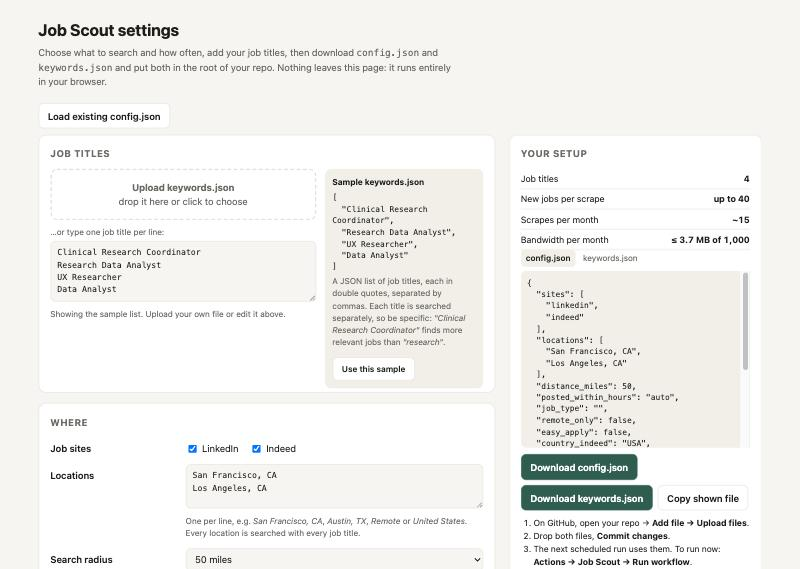

# Job Scout

A free, hands-off job scraper. On a schedule you choose, it searches LinkedIn
and/or Indeed for your job titles, saves each scrape as a dated CSV in your
Google Drive, adds every new job to one master Google Sheet, and emails you.
When you apply, change that job's **Status** in the master sheet.

Runs on GitHub Actions (free), stores everything in your own Google Drive, and
uses about **2 MB of proxy bandwidth a month**, well inside Webshare's free 1 GB.

```
Google Drive / Job Scout/
  Job Scout - Master              <- every job found. Status dropdown, Notes, link to its CSV
  Scrapes/
    2026-09-28_jobslist.csv       <- one file per scrape, never changed afterwards
    2026-09-30_jobslist.csv
```

Each job has only **Title, Company, Location, Salary, Link**, plus the site it
came from and the date found. No descriptions, no processing, no AI.

---

## Settings

Open **`settings/index.html`** in your browser. You can double-click it from a
download of this repo, or turn on GitHub Pages to get a link you can share.



1. Pick sites, locations, how often to scrape, how many jobs, and your time zone.
2. Upload your `keywords.json`, or type titles one per line. A sample is shown beside it.
3. Download `config.json` and `keywords.json`.
4. On GitHub, open your repo → **Add file → Upload files**, drop both files in, and **Commit**.

The page validates everything and warns about settings that won't do what you
expect. For example, it tells you when Indeed will ignore a job-type filter.

### keywords.json

A JSON list of job titles, each in double quotes:

```json
[
  "Clinical Research Coordinator",
  "Research Data Analyst",
  "UX Researcher",
  "Data Analyst"
]
```

Every title is searched in every location. Titles rotate between scrapes, so a
long list is covered over several runs rather than all at once.

---

## Using it

1. You get an email: "Job Scout: 40 new jobs".
2. Open **Job Scout - Master**. New jobs have Status **Not applied**.
3. After applying, set Status to **Applied**, then **Interviewing**, **Offer**,
   **Rejected**, **Ghosted**, **Withdrawn** or **Not interested** as things
   move. Fill in *Applied On* and *Notes* if you like.
4. **CSV File** shows which scrape each job came from, and links to that file.

Job Scout only ever **adds** rows to the master sheet. It never edits, sorts or
deletes them, so your Status and Notes are safe. Sort and filter it however you like.

A job is only added once. The same role found again, or posted on both LinkedIn
and Indeed, is skipped.

---

## Setup (about 20 minutes, once)

### 1. Your copy of the repo

Click **Use this template** (or fork), then set it up with the settings page
above. A public repo gets unlimited free Actions minutes. A private repo gets
2,000 a month, and a scrape takes about 2.

### 2. Google Drive access

You need an **OAuth client** (a `client_secret_….json` file), **not** a
service-account key. A service account has no Drive storage of its own, so it
can't create files in a personal Gmail Drive.

1. [console.cloud.google.com](https://console.cloud.google.com) → create a project.
2. **APIs & Services → Library**: enable **Google Drive API** and **Google Sheets API**.
3. **Google Auth Platform → Branding**: set any app name, and use your email for both email fields. Choose **External**.
4. **Data access → Add or remove scopes**: add `https://www.googleapis.com/auth/drive.file`, and nothing else.
5. **Audience → Publish app → In production.** Don't skip this: in *Testing*
   mode Google expires the login after 7 days and scraping silently stops.
   `drive.file` needs no Google review.
6. **Clients → Create client → Desktop app** → download the JSON.
7. On your computer, in this repo:

   ```bash
   python3 -m venv .venv
   ```
   ```bash
   .venv/bin/pip install -r requirements.txt
   ```
   ```bash
   .venv/bin/python authorize.py ~/Downloads/client_secret_XXXX.json
   ```

   Google warns that the app is unverified: click **Advanced → Go to (app name)**.
   The script prints three secrets for step 5.

`drive.file` only lets Job Scout see files it created itself. It can't read
anything else in your Drive.

### 3. Webshare proxies

GitHub's servers are data-center IPs that LinkedIn often blocks, so a proxy
helps. Webshare's free plan has 10 proxies and 1 GB a month.

Webshare offers two ways to authenticate, and **only one works on GitHub**:

| Webshare setting | Works on your computer | Works on GitHub Actions |
|---|---|---|
| **Username/Password** (lines like `host:port:user:pass`) | yes | **yes** |
| **IP authorization** (lines like `host:port`) | yes, if your IP is allowlisted | **no**: GitHub uses a different IP every run, so every proxy answers `407` |

For GitHub: in Webshare go to **Proxy → List**, set **Authentication** to
**Username/Password**, and **Download**. Paste the file's contents into the
`WEBSHARE_PROXIES` secret.

Each run first checks every proxy (a few hundred bytes each) and drops any that
refuse, so a few dead proxies don't break a scrape. If none work, it scrapes
directly and says so in the log.

For local runs, put the list in a `proxies.txt` file in the repo folder. It's
git-ignored, so it's never committed.

### 4. Email (optional)

With Gmail: turn on 2-Step Verification, then create an
[App Password](https://myaccount.google.com/apppasswords). Leave these secrets
out to skip email. GitHub also emails you automatically if a run **fails**.

### 5. GitHub secrets

**Settings → Secrets and variables → Actions → New repository secret**:

| Secret | Required | Value |
|---|---|---|
| `GOOGLE_CLIENT_ID` | yes | from `authorize.py` |
| `GOOGLE_CLIENT_SECRET` | yes | from `authorize.py` |
| `GOOGLE_REFRESH_TOKEN` | yes | from `authorize.py` |
| `WEBSHARE_PROXIES` | recommended | Webshare list in Username/Password format |
| `SMTP_USER` | optional | your Gmail address |
| `SMTP_PASSWORD` | optional | the 16-character App Password |
| `NOTIFY_EMAIL` | optional | where to send (defaults to `SMTP_USER`) |

### 6. Test it

**Actions → Job Scout → Run workflow**. With *Scrape now* ticked, it ignores
the interval. After about 2 minutes you should have a `Job Scout` folder in
Drive and an email. After that it runs on its own.

---

## How the schedule works

The workflow wakes **once a day** at 15:00 UTC. It scrapes only if
`scrape_every_days` have passed since the newest file in `Scrapes/`, so the
interval is a normal setting, not something to edit in the workflow file. Days
it skips take a few seconds and use no proxy bandwidth.

A run where **every** search fails uploads nothing, so it isn't counted as a
scrape and the next day tries again.

## All settings

`config.json` (the settings page writes this for you):

| Key | Default | Meaning |
|---|---|---|
| `sites` | `["linkedin","indeed"]` | which sites to search |
| `locations` | two CA cities | searched with every title; `"Remote"` and `"United States"` work too |
| `distance_miles` | `50` | search radius |
| `posted_within_hours` | `"auto"` | `"auto"` = since the last scrape; a number of hours; `0` = any time |
| `job_type` | `""` | `""` (any), `fulltime`, `parttime`, `contract`, `internship` |
| `remote_only` | `false` | only remote jobs |
| `easy_apply` | `false` | only LinkedIn Easy Apply / Indeed Apply jobs |
| `country_indeed` | `"USA"` | Indeed country |
| `annual_salary` | `false` | convert hourly and monthly pay to yearly |
| `scrape_every_days` | `2` | how often to scrape |
| `jobs_per_site` | `20` | new jobs per site per scrape |
| `max_per_search` | `10` | results requested per title+location search |
| `max_searches_per_site` | `8` | cap on searches per site per scrape |
| `max_mb_per_run` | `25` | hard bandwidth stop per scrape |
| `output_format` | `"csv"` | scrape file format: `csv` or `json` |
| `timezone` | `"UTC"` | your time zone; sets the date in file names |
| `drive_folder_name` | `"Job Scout"` | Drive folder; changing it starts a fresh folder |
| `email_when_no_new_jobs` | `false` | email even when a scrape found nothing new |

**Indeed limitation:** Indeed can use only one of *posted within* or *job type
/ remote only / easy apply*. While *posted within* is set, Indeed ignores the
others. LinkedIn applies everything.

## Try it locally

```bash
.venv/bin/python run.py --dry-run
```

This scrapes for real but skips Google and email, and writes
`out/<date>_jobslist.csv`. It uses `proxies.txt` if present.

---

## Bandwidth

Measured on real runs: **40 jobs ≈ 0.15 MB**, so about 2 MB a month when
scraping every 2 days.

- **LinkedIn**: job descriptions are never fetched. With them, jobspy loads
  every job's full page: about 76× more data (4 KB vs 321 KB per 10 jobs).
- **Indeed**: jobspy's query normally asks for 100 jobs plus company profiles.
  Job Scout rewrites it at runtime to ask for only `max_per_search` jobs and no
  profiles. Indeed still sends description text, because jobspy requires it;
  Job Scout discards it.

## Things to know

- **GitHub pauses scheduled workflows after 60 days with no commits.** It
  emails you first. Re-enable with one click in the Actions tab, or commit
  anything, for example a keyword change.
- The Google login stops working if you revoke the app, or if it goes unused for
  6 months. Run `authorize.py` again and update `GOOGLE_REFRESH_TOKEN`.
- `python-jobspy` is pinned. The Indeed tweak checks the query text before
  changing it. If a future jobspy version changes that text, the tweak turns
  itself off with a warning and scraping continues, using more bandwidth.
- Scraping may be against LinkedIn's and Indeed's terms of service. This is
  meant for modest personal use, so keep the volumes low.
